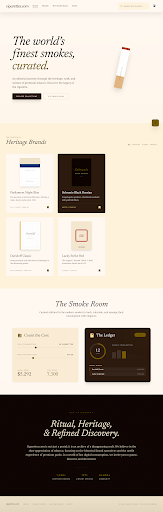

<div align="center">

<!-- Animated SVG Banner -->


<br/>

<!-- Glowing subline -->


<br/><br/>

<!-- Badges Row 1 -->
[](https://react.dev/)
[](https://www.typescriptlang.org/)
[](https://vitejs.dev/)
[](https://tailwindcss.com/)
[](https://www.framer.com/motion/)

<!-- Badges Row 2 -->
[](./LICENSE)
[](./webapp/src/data/brands.tsx)
[](#)

<br/>

---

<!-- Preview Screenshot -->


---

</div>

## ✦ What is this?

**Cigarettes.com** is a cinematic, editorial web archive dedicated to the heritage and culture of premium tobacco. It presents a curated catalog of **1,200+ brands** across eras and continents — rendered with the gravity and care of a museum collection, not a storefront.

> _"A love letter to packaging, craft, and the art of slow living."_

<br/>

---

## ✦ Features

<table>
<tr>
<td width="50%" valign="top">

### 🎬 Cinematic Intro
Full-screen animated introduction — plays once per session using physics-based transitions that set the tone before a single brand is shown.

### 🗂 Brands Grid
A scrollable, filterable archive of 1,200+ tobacco brands — organized by category, strength, and origin. Each card is a miniature exhibition.

### 🍂 The Smoke Room
An immersive editorial section with long-form content, atmospheric visuals, and a pace that rewards attention.

</td>
<td width="50%" valign="top">

### 🛠 Tools Section
Utility features for enthusiasts and collectors — precision-built, functionally minimal.

### 📖 About
Philosophy, archive statistics, and a timeline stretching back to **1871** — tracing the lineage of the collection.

### ✨ Animated Throughout
Every section uses **Framer Motion** for smooth, physics-based transitions — zero janky CSS hacks.

</td>
</tr>
</table>

<br/>

---

## ✦ Tech Stack

<div align="center">

| Technology | Role | Why |
|---|---|---|
| [React 19](https://react.dev/) | UI Framework | Concurrent features, server actions |
| [TypeScript](https://www.typescriptlang.org/) | Type Safety | Confidence at scale |
| [Vite](https://vitejs.dev/) | Build Tool | Sub-second HMR, lightning builds |
| [Tailwind CSS v3](https://tailwindcss.com/) | Styling | Design-token-first utility classes |
| [Framer Motion](https://www.framer.com/motion/) | Animations | Physics-based spring transitions |
| [Lucide React](https://lucide.dev/) | Icons | Clean, consistent iconography |
| [clsx](https://github.com/lukeed/clsx) + [tailwind-merge](https://github.com/dcastil/tailwind-merge) | Class Utilities | Collision-safe dynamic classnames |

</div>

<br/>

---

## ✦ Project Structure

```
cigarettes.com/
├── webapp/                         # React application
│   ├── public/                     # Static assets
│   └── src/
│       ├── components/
│       │   ├── home/               # Page sections
│       │   │   ├── CinematicIntro.tsx
│       │   │   ├── Hero.tsx
│       │   │   ├── BrandsGrid.tsx
│       │   │   ├── SmokeRoom.tsx
│       │   │   ├── ToolsSection.tsx
│       │   │   ├── About.tsx
│       │   │   ├── RitualTimer.tsx
│       │   │   └── Ashtray.tsx
│       │   └── layout/             # Navbar, Footer
│       ├── data/
│       │   └── brands.tsx          # 1,200+ brand entries
│       ├── lib/                    # Shared utilities
│       ├── App.tsx                 # Root component + intro gate
│       └── index.css               # Global styles
├── append_db.mjs                   # Brand database utility
├── rewrite_brands.mjs              # Brand data migration script
└── design_system.json              # Design token export
```

<br/>

---

## ✦ Getting Started

### Prerequisites

- **Node.js** v18+
- **npm** v9+

### Installation

```bash
# Clone the repo
git clone https://github.com/almostalok/cigarettes.com.git
cd cigarettes.com/webapp

# Install dependencies
npm install
```

### Development

```bash
npm run dev
# → http://localhost:5173  (HMR enabled)
```

### Production Build

```bash
npm run build        # outputs to dist/
npm run preview      # serve & verify dist/
```

### Lint

```bash
npm run lint
```

<br/>

---

## ✦ Design System

The visual identity is built around a warm, editorial palette — equal parts **old-world print media** and **dark luxury**.

<div align="center">

### Typography

| Token | Font | Usage |
|---|---|---|
| `font-headline` | **Newsreader** *(serif)* | Headings, display, pull quotes |
| `font-body` | **Noto Serif** *(serif)* | Body copy, descriptions |
| `font-label` | **Work Sans** *(sans-serif)* | Buttons, labels, UI chrome |

### Palette Highlights

| Role | Hex | Swatch |
|---|---|---|
| Primary Background | `#0d0300` |  |
| Surface | `#fff8f1` |  |
| Primary Fixed | `#fedcc8` |  |
| Secondary Container | `#fed977` |  |
| Inverse Primary | `#e1c0ad` |  |
| On-Surface | `#211b0c` |  |

</div>

> **Border Radius**: Intentionally conservative — `2px` default, `4px` large, `8px` XL — preserving a refined, print-inspired aesthetic.

<br/>

---

## ✦ Brand Categories

The archive spans the full spectrum of tobacco culture:

| Category | Description |
|---|---|
| 🏆 **Premium / Luxury** | Limited-edition and collector-tier brands |
| 🌿 **Light / Mild** | Low-nicotine, smooth-profile variants |
| ❄️ **Menthol** | Cooling and capsule-filter innovations |
| 🪔 **Unfiltered** | Raw, traditional, working-class staples |
| 🌏 **Indian Local** | ITC, GPI, VST — the subcontinent's own |
| 🌿 **Herbal / Ayurvedic** | Zero-nicotine botanical blends |
| 🌋 **Kretek** | Indonesian clove cigarettes |
| 🌍 **International** | Global icons — Marlboro, Camel, Lucky Strike |
| 💰 **Budget** | Mass-market, economy-tier staples |

<br/>

---

<div align="center">

<!-- Footer animated line -->


<br/>

**cigarettes.com** — *The Archive of Smoke & Heritage*

Made with 🍂 by [almostalok](https://github.com/almostalok)

</div>
